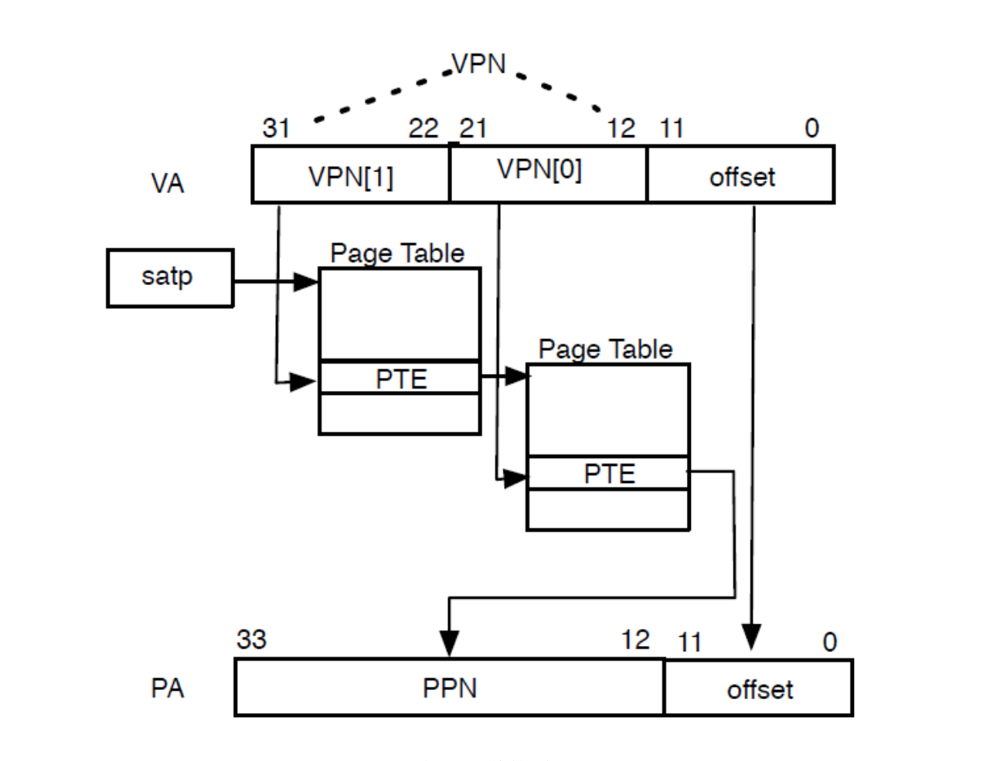
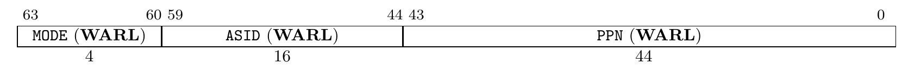
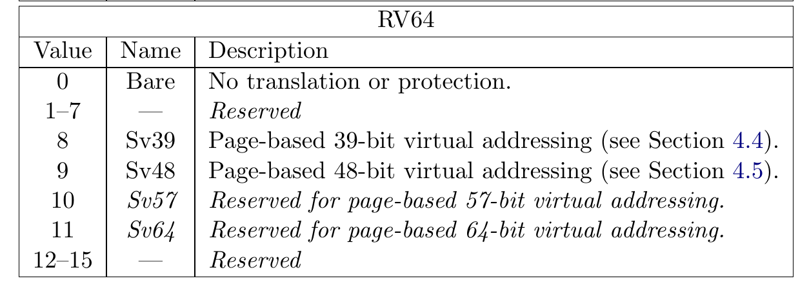
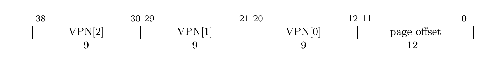
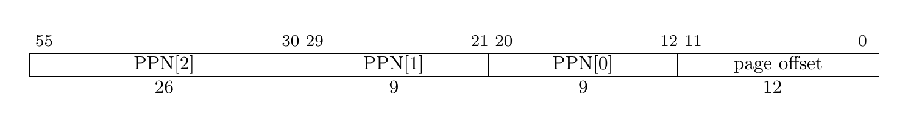
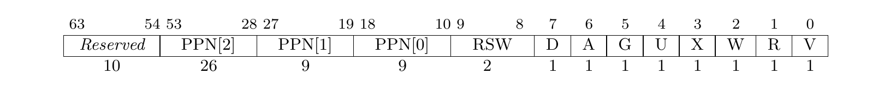

这一节我们将开启分页，从物理地址过渡到虚拟地址。

# 什么是虚拟内存

直到现在，我们的内核不受限制地跑在 CPU 上，可以直接访问任何一处物理地址。这时假如内核加载并运行用户程序，用户程序可以几乎无限制的读写物理内存。对于恶意程序，它可以杀死其它程序甚至可以杀死内核，将整个系统的资源据为己有；对于遵纪守法的程序，它必须小心翼翼地控制自己，避免无意中修改了其他程序。显然，这种无限制的环境既给了程序自由，又让程序处于随时可能被破坏的境地。

现代操作系统一般都实现了虚拟内存，程序跑在虚拟内存上，不直接访问物理内存，并且每个程序（进程）都有相同的地址空间。应用程序不需要再担心被别的程序破坏或者不小心写了别的程序的内存，也不再需要考虑自己在内存中的哪个位置。

尽管程序跑在虚拟内存上，但是最终一定是访问到物理内存，虚拟内存只是操作系统的抽象。每当程序访问某个虚拟地址，硬件和操作系统会将虚拟地址转化为某个物理地址，然后程序访问到对应的物理内存。显然，实现虚拟内存的关键就在于**设置虚拟地址到物理地址的映射**。

考虑这样的情况，程序 A 访问虚拟地址 100，程序 B 也访问虚拟地址 100。对于程序 A，操作系统将虚拟地址 100 映射到物理地址 1000；对于程序 B，操作系统将物理地址映射到物理地址 2000。虽然两程序访问同一地址，但最终却访问到物理内存的不同位置。按照这种思路，让不同的程序拥有相同的虚拟地址空间，将其中的虚拟地址映射到不同的物理地址，这样就实现了“每个进程都有相同的地址空间”的抽象。相同虚拟地址可以映射到不同的物理地址，同样的，不同的虚拟地址也可以映射到同一物理地址，这样就实现了不同程序共享同一块内存。

经过以上讨论，相信同学们已经理解了实现虚拟内存的思路。虚拟内存需要软硬件协作才能够高效实现，并且硬件提供的机制制约着操作系统的实现方式，接下来介绍 RISC-V 提供的虚拟内存机制。

# 实现虚拟内存的硬件基础

RISCV 提供了传统的基于页面的虚拟内存机制。当未开启分页时，程序发出访问内存的指令，处理器就访问该内存地址；开启分页时，处理器 *MMU*（*Memory Manegement Unit*）先查询页表，将接收到的（虚拟）地址转换为物理地址，然后再访问转换后的地址。硬件完成了查询页表，将虚拟地址转换为物理地址的过程，此过程对软件是透明的。但硬件不能直接知道虚拟地址到物理地址的映射，软件主要的职责就是这一映射关系，并在恰当的时候将它写入到页表中。

现代处理器提供的分页机制基本都使用多级页表，将虚拟地址划分多个虚拟页号（*VPN*, *Virtual Page Numer*）和页内偏移（*offset*）。上一级页表中的页表项（*PTE*）指向下一级页表的起始物理地址，最后一级页表中页表项指向虚拟地址对应的物理地址。将页表看作页表项数组`pte page_table[]`，某一级 VPN 就是该级页表项数组的索引。以下步骤查询页表获取物理地址：

1. 找到一级页表（页目录）的物理地址，这个地址存放在**控制寄存器 stap** 中
2. 根据 VPN 找到包含下级页表起始物理地址的页表项
3. 重复步骤 2，直到查找到最后一级页表
4. 读取页表项中的物理地址

这个过程可以表示为下图（RV32 的页表访问过程）：



每次访问内存都要查找页表，查找页表要涉及多次内存访问操作，这会严重影响 CPU 读取指令和读写数据的性能。为了解决这个问题，现代处理器使用了 *TLB*（*Translation-Lookaside Buffer*）来加快虚拟地址到物理地址的转换。TLB 是缓存虚拟地址到物理地址映射关系的*全相连高速缓存*，可以看作一个数组，元素存储映射关系。访问内存时，先从 TLB 中查找物理地址，如果查找到（TLB hit），就不需要查找页表，避免的耗时的内存访问；如果没查找到（TLB miss），再查找页表并将映射缓存进 TLB。良好的程序都会重复利用*局部性原理*，并且现代处理器还将指令和数据划分开，分别使用独立的 TLB，取指令用 iTLB，读写数据用 dTLB，还可能存在共用的 uTLB，显著提高地址转换的性能。

 本内核不对 TLB 进行细粒度的管理，不介绍 TLB 词条的结构。这里给出一个 TLB 的实例，用 perf 分析进程 5200（firefox 浏览器）在 21 秒内的 TLB miss rate：

```
SHELL> perf stat -e dTLB-loads,dTLB-load-misses,iTLB-loads,iTLB-load-misses -p 5200

^C
 Performance counter stats for process id '5200':

     1,760,539,473      dTLB-loads:u
         6,163,558      dTLB-load-misses:u        #    0.35% of all dTLB cache accesses
         9,156,828      iTLB-loads:u
         4,551,108      iTLB-load-misses:u        #   49.70% of all iTLB cache accesses

      21.205687845 seconds time elapsed
```

可见，数据 TLB 的命中率接近 100%，指令 TLB 的命中率比较低，但也接近 50%。

分页管理中，每个进程都有自己独立的虚拟地址空间，为了避免进程切换后通过 TLB 访问到上一进程的映射，将虚拟地址转换为错误的物理地址，通常发生进程切换时要刷新 TLB（清除 TLB 缓存）。

了解了查询页表的过程再看本内核使用的分页方式。RV32 仅支持 Sv32（即上图展示的方式），RV64 目前仅支持 2 种分页方式，分别是支持 39 位虚拟地址空间的 Sv39 和支持 48 位虚拟地址空间的 Sv48，本内核使用最常用的 Sv39 方案。Sv39 支持 39 位虚拟地址空间，56 位物理地址空间（是的，物理地址空间往往大于虚拟地址空间，32 位机只支持 32 位地址空间指的是虚拟地址空间），每页 4096 字节，共$2^{27}$页。

stap 控制寄存器格式如下：



MODE 表示分页模式，有以下选项：



*ASID*（*Address Space IDentifier*) 用来标识 TLB 词条中映射归属的地址空间，ASID 类似于进程 ID，每个进程都有一个 ASID。TLB 中多个进程的虚拟地址-物理地址映射共存，MMU 在查询 TLB 时会忽略不属于当前进程的映射，在进程切换时只需要修改 ASID，不需要刷新 TLB，降低了进程切换的成本。本实验不使用 ASID。

PPN 表示页目录项的物理页号（物理地址右移 12 位）。

WARL 是 *Write Any values, Read Legal Values* 的简称，表示对应字段可以写入任意值，处理器仅在该字段的值合法时读取，否则忽略该字段。

虚拟地址和物理地址结构如下：





虚拟页大小和物理页相同，每页都是 4096 字节，因此页内偏移必须是$0 - 4095$，占据虚拟地址低 12 位，共 $2^{27}$ 页。为了确保每个页表大小相同，只能将剩下的 27 位三分，因此每个 VPN 9 位，一个页表共有 512 项，占据一页。

页表项包含下一级页表起始地址或虚拟页对应的物理页的起始地址，但不会直接将完整物理地址写进去，这样占用空间太大了，通常要求页表物理地址 4K 对齐（即起始地址的低 12 位全为 0），省去页内偏移，用剩余的空间存放标志位。Rv39 页表项结构如下：



| 标志位 | 意义 |
| :- | :- |
| RSW | 供操作系统使用，硬件会忽略 |
| D(Dirty) | 自上次清除 D 位以来页面是否被弄脏（如被写入） |
| A(Access) | 自上次清除 A 位以来页面是否被访问 |
| G(Global) | 是否对所有虚拟地址均有效，通常用以标记内核的页表，本实验不使用 |
| U(User) | 是否是用户所有的页。U = 1 则只有 U-mode 可访问，而 **S 模式不能**，否则只有 S-mode 可访问 |
| X(eXecutable) | 结合 U 位判断当前状态是否可执行 |
| W(Writable) | 结合 U 位判断当前状态是否可写 |
| R(Readable) | 结合 U 位判断当前状态是否可读 |
| V(valid) | 有效位。若 V = 0，表示该页不在物理内存中，任何遍历到此页表项的虚址转换操作都会导致页错误 |

从上面的表可以看到，RISCV 的权限控制非常严格，U-mode 只能访问”用户态“（U 位置位）的页，S-mode 只能访问”内核态“的页。有时确实需要在内核态读取用户态进程所有的页，RISCV 虽然默认不允许，但仍然为操作系统开了后门。当置位 `status` 寄存器中的 SUM 位时，可以在 S-mode 访问”用户态“页。

此外如果 R、W 和 X 位都是 0，那么这个页表项是**指向下一级页表的指针**，否则它是页表树的一个叶节点。此时它们可以有个特殊用法——实现**大页模式**。当中间某级页表 RWX 位不均为 0 时，CPU 将直接提取出 PTE 中的物理地址，不再考虑下级页表。利用这个特性，将一级页表中的 PTE RWX 某一位置位，一个 PTE 就可以映射 1GiB 地址空间，将二级页表中的 PTE RWX 某一位置位，一个 PTE 就可以映射 2MiB 地址空间。

以上就是 RISCV 虚拟内存机制的全部内容。

# 处理器地址、可执行文件与虚拟内存

程序经过编译链接生成可执行文件，执行时加载进内存，执行指令、访问数据都需要 CPU 访问内存地址，这个内存地址就**硬编码**在可执行文件中。

为了理解可执行文件中的地址和处理器执行时访问的内存地址的关系，在 x86-64 GNU/Linux 中做一个小实验。示例代码如下：

```c
// 文件名：global.c
// 编译命令：gcc global.c
#include <stdio.h>
int global = 1;
int main()
{
	printf("%p\n", &global);
    return 0;
}
```

这个程序经过编译生成汇编代码，汇编后生成 .o 文件（可重定位目标文件），链接后生成 ELF 可执行文件 a.out。生成的 .o 文件未经链接，其中的指令地址都是相对于文件起始地址 0 的偏移，访问地址的指令中地址部分都被编码为 0。在链接阶段，多个 .o 文件聚合为一个可执行文件，指令地址被修改为运行时的**绝对地址**，数据、函数的地址有多种方式表示，但不管使用哪种方法，都一定会获取到一个固定的运行时地址。

运行时，操作系统的加载器会分析可执行文件的格式，查找到程序入口点（C/C++ 程序一般是`main()`），并跳转执行。`main()`函数的地址就是通过解析 ELF 可执行文件获取到的。我们可以使用 readelf ELF 格式可执行文件的完整信息。

查看 a.out 中`global`的地址：

```shell
SHELL>readelf -s a.out | grep global
82: 0000000000404024     4 OBJECT  GLOBAL DEFAULT   23 global
```

可以看到`global`是一个全局符号，大小是 4 字节，类型是 OBJECT（变量），可见性为 DEFAULT（可以理解为具有外部链接），地址是`0000000000404024`。我们运行该程序查看运行时`global`的地址是否和 readelf 看到的一样：

```shell
SHELL>./a.out
0x404024
```

可见全局符号（非 static 全局变量，非 static 函数）的地址在编译时就已经确定，我们还可以用 objdump 反汇编看到每一条指令运行时地址。由于所有指令、全局数据的地址在编译链接时已经确定，我们必须在编译链接时就确定进程的虚拟地址空间布局。

本操作系统中，使用 RV32 的进程虚拟地址空间布局，布局如下：

```
0xFFFFFFFF----->+--------------+
                |              |
                |              |
                |    Kernel    |
                |              |
                |              |
0xC0000000----->---------------+
                |    Hole      |
0xBFFFFFF0----->---------------+
                |    Stack     |
                |      +       |
                |      |       |
                |      v       |
                |              |
                |              |
                |      ^       |
                |      |       |
                |      +       |
                | Dynamic data |
       brk----->+--------------+
                |              |
                | Static data  |
                |              |
                +--------------+
                |              |
                |     Text     |
                |              |
0x00010000----->---------------+
                |   Reserved   |
0x00000000----->+--------------+
```

内核占据虚拟地址空间的`0xC0000000`到`0xFFFFFFFF`，可用的物理内存空间是`0x80000000`到`0x88000000`，内核的起始物理地址和虚拟物理地址恰好相差`0x40000000`，得到虚拟地址和物理地址之间的转换关系：

$$VirtualAddress = PhysicalAddress + LinearOffset$$

内核虚拟地址空间就是可用物理内存地址空间的线性映射：

$$
VirtualAddressSpace[0xC0000000,C8000000) \longrightarrow PhysicalAddressSpace[0x80000000, 88000000)
$$

程序中使用以下宏表示线性映射：

```c
// include/mm.h
#define LINEAR_OFFSET    0x40000000
#define PHYSICAL(vaddr)  (vaddr - LINEAR_OFFSET)
#define VIRTUAL(paddr)   (paddr + LINEAR_OFFSET)
```

最开始，内核程序入口点在 0x80200000，转换为虚拟地址后变成 0xC0200000。我们在链接脚本中写入这个地址：

```linker.ld
/* 目标架构 */
OUTPUT_ARCH(riscv)
/* 执行入口 */
ENTRY(_start)
/* 起始地址 */
BASE_ADDRESS = 0xc0200000;
```

这样，可执行文件中的地址全部大于 0xC0200000，我们确保了可执行文件中的地址与规定的虚拟地址空间一致。

# 开启分页

开启分页的过程中，我们要面临的核心问题是：如何完成物理地址到虚拟地址的平稳过渡？

启动系统后，SBI 将去除了调试信息的可执行文件加载到物理地址`0x82000000`并跳转执行，这时还没有启动分页模式，处理器访问的是物理地址。在将页目录物理地址写入到 stap 寄存器后，处理器访问的就是虚拟地址。我们怎样确保在开启分页后，页表中有能确保程序正常运行的虚拟地址到物理地址的映射？

一种思路是提前写好所有页表。Rv39 是三级页表，结构比较复杂，一二级页表 PTE 必须指向下级页表起始地址，直接硬编码要写数百个页表，GNU 汇编的宏功能不完备，没法用宏实现这个功能，需要专门写一个程序生成汇编文件 entry.s，这样的文件基本没有可读性，非常丑陋。

另一种思路是先让内核跑起来，然后内核自己填充页表，实现内核的线性映射。我们选择第二种方法，分两步实现内核自映射：

1. 硬编码一个临时页表，让内核跑起来
2. 填充页表，实现线性映射

Rv39 的三级页表结构让我们很难直接硬编码，观察内核地址，会发现物理内存起始地址 0x80000000 和内核区起始地址 0xC0000000 都是 1 G 的整数倍。使用大页模式，页目录中的一项即可映射 1G 内存，硬编码页表只需要写两项 PTE 即可，其他项均设置为 0。

```assembly
boot_pg_dir:
    .zero 2 * 8
    .quad (0x80000000 >> 2) | 0x0F
    .quad (0x80000000 >> 2) | 0x0F
    .zero 508 * 8
```

之后我们将页目录地址写入到寄存器 stap 中并刷新 TLB，跳转到 main 函数。

```assembly
# init/entry.s
    .globl boot_stack, boot_stack_top, _start, boot_pg_dir
    .section .text.entry
_start:
    la t0, boot_pg_dir
    srli t0, t0, 12
    li t1, (8 << 60)
    or t0, t0, t1
    csrw satp, t0
    sfence.vma

    li t1, 0x40000000
    la sp, boot_stack_top
    add sp, sp, t1
    la t0, main
    add t0, t0, t1
    jr t0

    .section .bss
boot_stack:
    .space 4096 * 8
boot_stack_top:
```

前面提到，全局变量、函数的地址在编译时已经确定，我们这里取到的地址的值应该与 readelf 读取到的地址完全一样，但实际上并非如此。符号的地址是固定的，取地址的方式却有多种，取决于编译使用的*代码模型*和编译选项。

假设程序中有一个变量`global`，地址是 1000，编译器生成访问`global`的代码时有多种选择：

- 硬编码地址：直接将地址 1000 写死到程序中
- PC 相对寻址：将`global`地址到访问它的指令地址的差值 Offset 写入程序中，通过 PC + Offset 获取地址 1000,
- 位置无关代码：将`global`的地址存放到某个固定的地址中，访问时加载器查找`global`的地址并将其写入，程序从这个地址取出（通常是 PC 相对寻址）`global`的地址，再读写`global`。

位置无关代码一般用于*动态链接*的可执行文件，某些 Linux 发行版上的 GCC 在编译时加入了特定的参数，总是生成*位置无关可执行文件*，为了确保所有的地址都通过 PC-relative 寻址获取。本内核使用 medany 代码模型，并使用 -fno-pie 禁止生成位置无关可执行文件。

从 PC 相对寻址的原理可以看出，程序是否能够获取到正确的地址，完全取决于运行时 PC 的值是否编译器期待的指令地址。在本实验中，可执行文件中指令地址都从 0xC0200000 开始，而加电后 PC 却指向 0x8020000，可执行文件中指令的地址总是跟 PC 相差 0x40000000。考虑这种情况，`global`地址 为 0xC0201010，可执行文件指令地址为 0xC0200010，编译器认为执行到这条指令时，PC 的值是 0xC0200010，通过 PC + 0x1000 获取`global`的值，运行时 PC 的值却是 0x80200010，PC + 0x1000 获取到的地址是 0x80201010，跟`global`的值相差 0x40000000。

`la`即 *Load Address* 是一条汇编指令，用于取符号的地址，在这里被拓展为 auipc/addi 指令序列（PC 相对寻址），获取虚拟地址需要加上 0x40000000。

完成以上工作后，我们开始创建内核的线性映射。全局变量`pg_dir`指向当前页目录，所有和页表有关的函数，都通过`pg_dir`来处理页表。

```c
uint64_t page = get_free_page();
assert(page, "mem_init(): fail to allocate page");
uint64_t *kernel_pg_dir = (uint64_t *)VIRTUAL(page);
pg_dir = kernel_pg_dir;
```

创建映射的过程就是遍历页表，若页表不存在就创建，直到最后一级页表，将物理页号和标志位写进 PTE。代码如下：

```c
/**
 * @brief 建立物理地址和虚拟地址间的映射
 *
 * 本函数仅仅建立映射，不修改物理页引用计数
 * 当分配物理页失败（创建页表）时 panic，因此不需要检测返回值。
 *
 * @param page   物理地址
 * @param addr   虚拟地址
 * @param flag   标志位
 * @return 物理地址 page
 * @see panic(), map_kernel_page()
 */
uint64_t put_page(uint64_t page, uint64_t addr, uint8_t flag)
{
	assert((page & (PAGE_SIZE - 1)) == 0,
	       "put_page(): Try to put unaligned page %p to %p", page, addr);
	uint64_t vpns[3] = { GET_VPN1(addr), GET_VPN2(addr), GET_VPN3(addr) };
	uint64_t *page_table = pg_dir;
	for (size_t level = 0; level < 2; ++level) {
		uint64_t idx = vpns[level];
		if (!page_table[idx]) {
			uint64_t tmp;
			assert(tmp = get_free_page(),
			       "put_page(): Memory exhausts");
			page_table[idx] = (tmp >> 2) | 0x01;
		}
		page_table =
			(uint64_t *)VIRTUAL(GET_PAGE_ADDR(page_table[idx]));
	}
	page_table[vpns[2]] = (page >> 2) | flag;
	return page;
}
```

有了`pug_page()`，只需要一页一页地映射虚拟页和物理页即可。

```c
void map_kernel()
{
	uint64_t phy_mem_start;
	uint64_t phy_mem_end;
	uint64_t vir_mem_start;

	phy_mem_start = MEM_START;
	phy_mem_end = MEM_END;
	vir_mem_start = KERNEL_ADDRESS;
	while (phy_mem_start < phy_mem_end) {
		put_page(phy_mem_start, vir_mem_start, KERN_RWX | PAGE_PRESENT);
		phy_mem_start += PAGE_SIZE;
		vir_mem_start += PAGE_SIZE;
	}
}
```

内核区仅仅是物理内存的线性映射，内核要通过内核区的线性映射无限制地访问物理内存，所以为内核区的页开启了 RWX 权限。

创建这个映射的过程中没有修改系统正在使用的页表，还需要切换页表，让新映射生效。

```c
/**
 * @brief 激活当前进程页表
 * @note 置位 status 寄存器 SUM 标志位，允许内核读写用户态内存
 */
void active_mapping()
{
	__asm__ __volatile__("csrs sstatus, %0\n\t"
			     "csrw satp, %1\n\t"
			     "sfence.vma\n\t"
			     : /* empty output list */
			     : "r"(1 << 18),
			       "r"((PHYSICAL((uint64_t)pg_dir) >> 12) |
				   ((uint64_t)8 << 60)));
}
```

我们给了内核读写用户态内存的特权，这样做可能会导致一定的安全问题，但方便了应用态和内核态之间的数据传送。

至此，我们从物理地址过渡到了虚拟地址。

# 问题

1. RISCV 提供的虚拟地址空间是连续的吗？如果不是，请指出合法的虚拟地址空间？
2. RISCV 提供的虚拟地址空间和进程的虚拟地址空间是一个东西吗？
3. 为什么临时页表要有$[0x80000000, 0xC0000000) \longrightarrow[0x80000000, 0xC0000000)$的映射？
4. 删去第 3 问所提到的映射（实际上是错误的做法），在 QEMU 中执行似乎没有问题，请说说你对可能的原因的猜测，有能力的同学可以尝试验证你的猜测。
5. 为什么要再分配页目录和页表，而不直接修改原来的页表？
6. 为什么链接后的内核中所有的地址都是 `0xc0200000` 之后的，但 sbi 启动到 `0x80200000` 还可以正确执行呢？